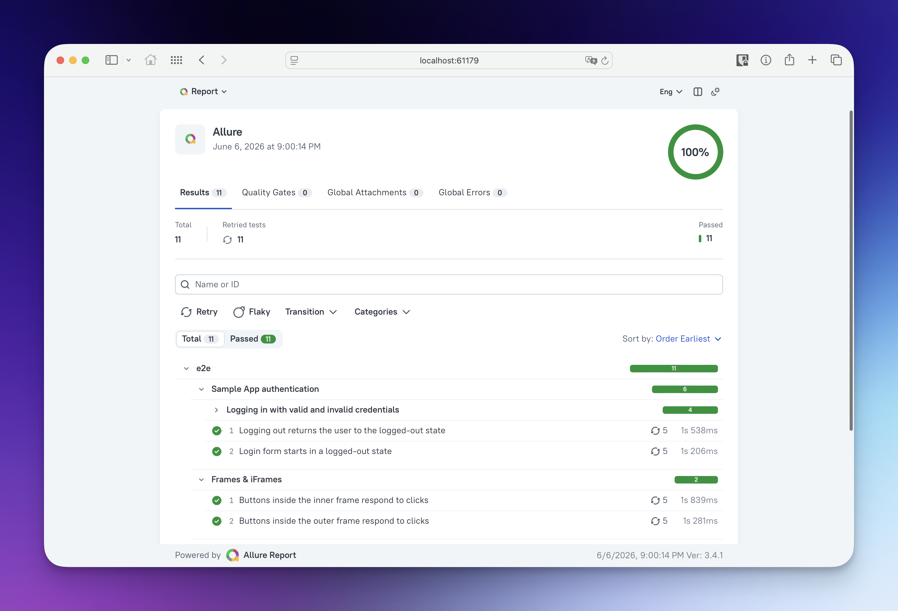
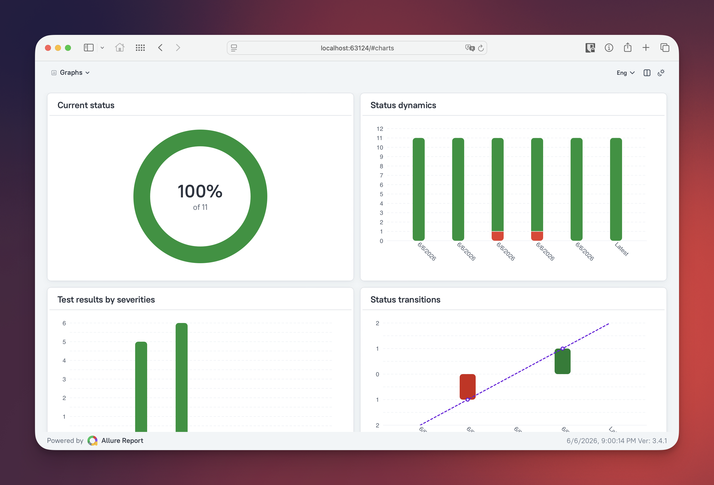
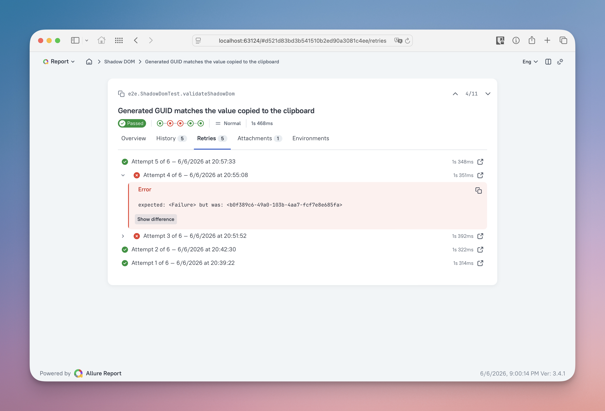
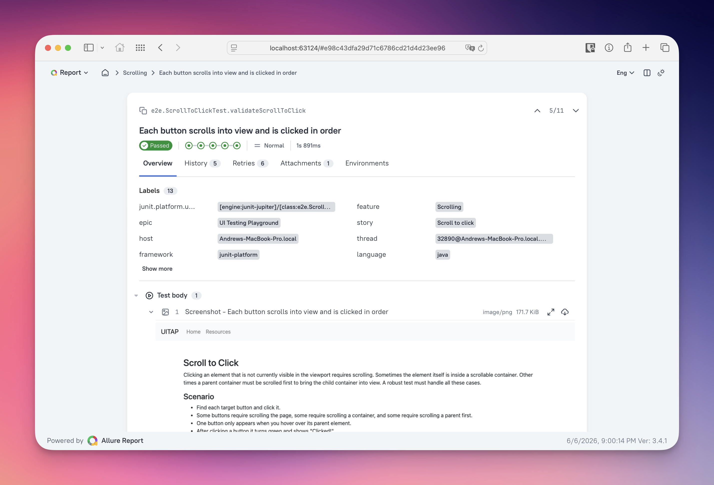
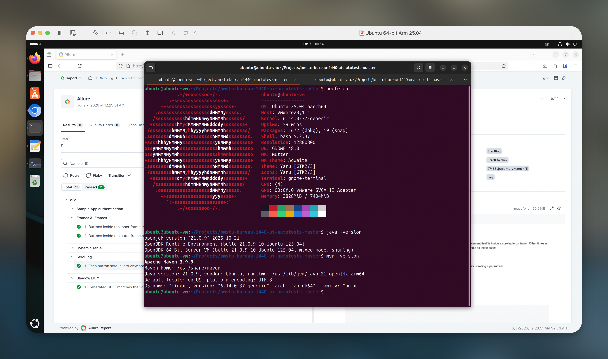

# UI Testing Playground — E2E-тесты на Playwright

> [!NOTE]
> Пример отчета: 👉🏻 [allure-report.s3-website.cloud.ru](https://allure-report.s3-website.cloud.ru/)

E2E UI-тесты для [UI Testing Playground](http://www.uitestingplayground.com) на [Playwright](https://playwright.dev/java/) и [JUnit 5](https://junit.org/junit5/) + с отчетами в [Allure](https://allurereport.org/)









## Требования

Для корректной работы проекта требуются:

- JDK 21+ (LTS)
- Maven 3.9.x
- Браузер Google Chrome

## Структура проекта

```
src/
  main/java/com/bmstu_bureau_1440/pages/   # Классы с логикой, специфичной для страниц (Frames, SampleApp, ShadowDom, ...)
  test/java/e2e/                           
    config/                                # Классы конфигурации
    fixtures/                              # Базовая Playwright-fixture + расширение Allure для скриншотов
  test/resources/
    playwright.yml                         # Конфигурация: текущий используемый браузер + настройки
    allure.properties                      # Параметры Allure
```

## Конфигурация

Текущий используемый для тестирования браузер и его настройки задаются в файле [`playwright.yml`](src/test/resources/playwright.yml).

Параметры генерации отчета Allure задаются в файле [`allure.properties`](src/test/resources/allure.properties).

## Запуск тестов

> [!IMPORTANT]
> Перед запуском тестов убедитесь, что в системе установлены требуемые версии JDK и Maven.
> 
> Пример подготовительных команд для Ubuntu:
> ```bash
> sudo apt update
> sudo apt install openjdk-21-jdk
> sudo apt install maven
> ```
> 

### Запуск всех тестов

```bash
mvn test
```

### Запуск тестов по отдельности

Для запуска отдельного класса с тестами или отдельного метода используйте параметр `-Dtest`:

```bash
mvn test -Dtest=SampleAppTest
```

## Отчёты

### Просмотр отчёта

Формирует отчёт из последних результатов и открывает его в браузере:

```bash
mvn exec:exec@allure-serve
```

### Генерация статического отчёта

Собирает статический HTML-отчёт и помещает его в `target/site/allure-maven-plugin/`:

```bash
mvn allure:report
```